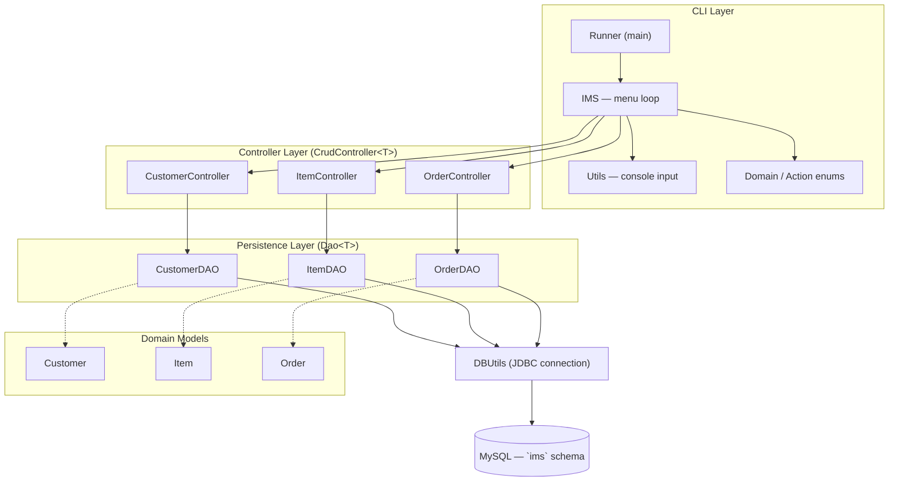

# Inventory Management System

A terminal-based inventory management system written in Java. It lets you create, read, update and delete **customers**, **items** and **orders**, persisted to a MySQL database over JDBC.

## Features

- Simple text-menu CLI — pick an entity (Customer / Item / Order), then a CRUD action
- Full Create / Read / Update / Delete support for all three entities
- Input validation with re-prompting on invalid menu choices or non-numeric input
- MySQL persistence via JDBC (schema provided as a SQL script)
- Log4j2 logging to both the console and an `errors.log` file
- Unit tests (DAO + domain classes) and integration tests (controllers, using Mockito) with JaCoCo coverage reporting

## Architecture

The app follows a simple layered architecture: a CLI loop drives **Controllers**, which handle user I/O and delegate persistence to **DAOs**, which talk to MySQL via JDBC.



**Layers**

| Layer | Classes | Responsibility |
|---|---|---|
| Entry point | `Runner`, `IMS` | Boots the app, runs the main menu loop (choose domain → choose action) |
| Controller | `CustomerController`, `ItemController`, `OrderController` (all implement `CrudController<T>`) | Reads/validates user input from the console, calls the matching DAO, prints results |
| Persistence (DAO) | `CustomerDAO`, `ItemDAO`, `OrderDAO` (all implement `Dao<T>`) | Runs parameterized SQL (`PreparedStatement`) against MySQL and maps `ResultSet` rows to domain objects |
| Domain | `Customer`, `Item`, `Order`, `Domain`, `Action` | Plain data objects plus the two menu enums |
| Utilities | `Utils`, `DBUtils` | Console input parsing (`Scanner`) and JDBC connection management (reads `db.properties`) |

### Data model

Three independent tables — there are currently no foreign keys linking them (an order isn't tied to a specific item or customer):

- `customers` (`id`, `first_name`, `surname`)
- `items` (`id`, `items`, `inventory`)
- `orders` (`id`, `price`, `amount`)

## Tech stack

- Java 8 (`maven.compiler.source/target` in `pom.xml`)
- Maven (build & dependency management)
- MySQL (via `mysql-connector-java`)
- Log4j2 (logging)
- JUnit 4, Mockito, EqualsVerifier, H2 (tests)
- JaCoCo (test coverage)

## Project structure

```
src/main/java/com/qa/ims/
├── Runner.java                # main() entry point
├── IMS.java                   # menu loop / dispatch
├── controller/                # CrudController + Customer/Item/Order controllers, Action enum
├── persistence/
│   ├── dao/                   # Dao<T> + Customer/Item/OrderDAO (JDBC)
│   └── domain/                # Customer, Item, Order, Domain enum
├── exceptions/                # CustomerNotFoundException
└── utils/                     # Utils (console input), DBUtils (JDBC connection)
src/main/resources/
├── db.properties              # DB connection settings
├── log4j2.xml                 # logging config
├── sql-schema.sql             # creates the `ims` schema + tables
└── sql-data.sql               # sample seed data
```

## Getting Started

### Prerequisites

- Java Runtime Environment (JRE) 17, or any JRE/JDK 8+
- MySQL (https://dev.mysql.com/downloads/)
- An IDE (e.g. Eclipse) if you want to build/run from source

### Installing

1. Install the JRE onto your computer.
2. Install MySQL. The default configuration expects username `root` and password `root` — if you use different credentials, update them in **both** `src/main/resources/db.properties` and `src/test/resources/db.properties`.
3. Add MySQL to your system's PATH (see the [MySQL Windows install guide](https://dev.mysql.com/doc/mysql-windows-excerpt/5.7/en/mysql-installation-windows-path.html)).
4. Open a terminal and log in: `mysql -u root -p` (swap `root` for your username if different).
5. From `src/main/resources`, run `sql-schema.sql` to create the `ims` database and its tables.
6. From the `target` folder, run the pre-built jar:
   ```
   java -jar ims-0.0.1-jar-with-dependencies.jar
   ```
   (or build it yourself with `mvn clean package` first — see [Building](#building) below)

### Configuration

Connection details live in `src/main/resources/db.properties`:

```properties
db.url=jdbc:mysql://localhost:3306/ims
db.user=root
db.password=root
```

Edit this file if your MySQL instance uses a different host, port, or credentials.

### Building

```
mvn clean package
```

This produces two jars in `target/`:
- `ims-0.0.1.jar` — just the compiled classes (needs dependencies on the classpath separately)
- `ims-0.0.1-jar-with-dependencies.jar` — a runnable "fat jar" with all dependencies bundled (main class: `com.qa.ims.Runner`)

## Usage

```
Welcome to the Inventory Management System!
Which entity would you like to use?
CUSTOMER: Information about customers
ITEM: Individual Items
ORDER: Purchases of items
STOP: To close the application
```

Selecting an entity (e.g. `CUSTOMER`) shows the available actions:

```
What would you like to do with customer:
CREATE: To save a new entity into the database
READ: To read an entity from the database
UPDATE: To change an entity already in the database
DELETE: To remove an entity from the database
RETURN: To return to domain selection
```

Invalid input is rejected and re-prompted:

```
What would you like to do with customer:
CREATE: To save a new entity into the database
READ: To read an entity from the database
UPDATE: To change an entity already in the database
DELETE: To remove an entity from the database
RETURN: To return to domain selection
creagw
Invalid selection please try again
create
Please enter a first name
Harrt
Please enter a surname
Byejr
Customer created
```

## Running the tests

- Open the project in your IDE
- Right-click `src/test/java` and choose **Run As → JUnit Test**

Tests connect to the same MySQL server as the app (via `src/test/resources/db.properties`), initializing the schema/data from `src/test/resources/sql-schema.sql` and `sql-data.sql` before each DAO test — a local MySQL instance must be running for them to pass.

### Unit tests

Test the `CustomerDAO`, `ItemDAO` and `OrderDAO` classes, along with the `Customer`, `Item` and `Order` domain classes (equality/hashcode via EqualsVerifier).

### Integration tests

Test the controller classes using Mockito to mock out the DAO layer, so they don't depend on the database.

## Known limitations

- **No foreign keys** — `orders`, `items` and `customers` aren't relationally linked, so an order can't be tied back to the item or customer it belongs to.
- **Hardcoded DB credentials** — `db.properties` ships with `root`/`root` and isn't environment-configurable out of the box.
- **Tests share the app's `ims` schema** — `src/test/resources/db.properties` points at the same `localhost:3306/ims` database as the app, and the DAO tests drop/recreate all three tables before every test. Point it at a separate schema (e.g. `ims_test`) if you don't want test runs touching your real data.
- Declared **JRE 17** as a prerequisite, but the code is compiled for Java 8 (`maven.compiler.source/target`) — either works, but the two aren't aligned.

## Built With

* [Maven](https://maven.apache.org/) - Dependency Management

## Versioning

We use [SemVer](http://semver.org/) for versioning.

## Authors

* **Iman Kassim**

## License

This project is licensed under the MIT license - see the [LICENSE.md](LICENSE.md) file for details

*For help in [Choosing a license](https://choosealicense.com/)*
